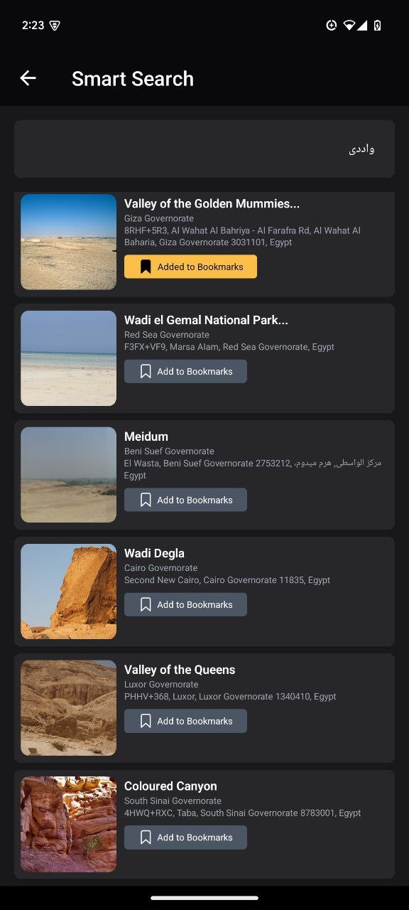
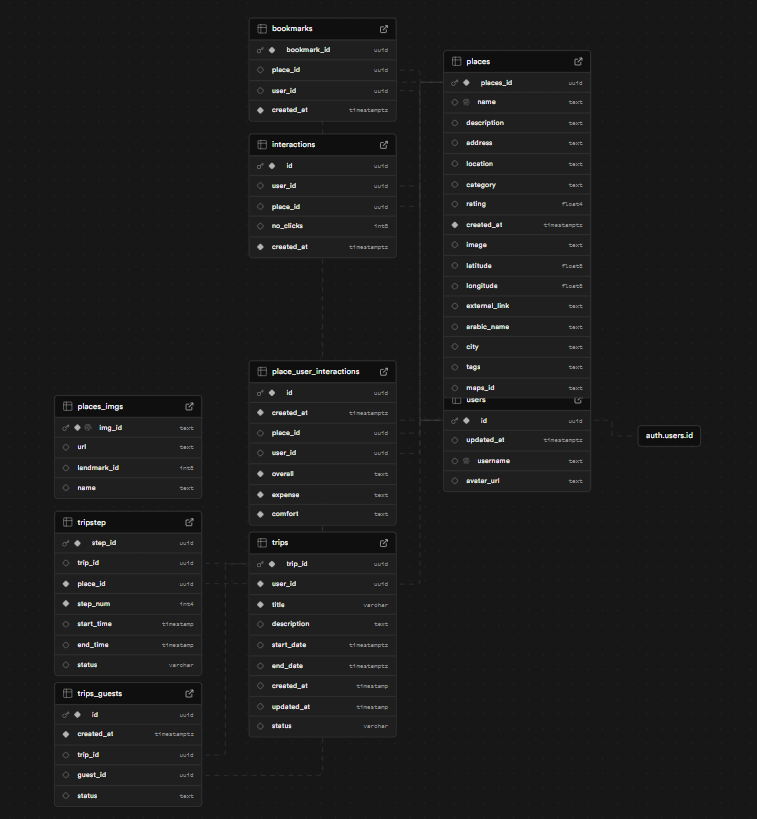

# BENA: Revolutionizing Travel in Egypt with AI-Powered Itineraries

## Table of Contents

*   [About](#about)
*   [Key Screens and Features](#key-screens-and-features)
    *   [Sign-In Screen](#signin-screen)
    *   [Explore Screen](#explore-screen)
    *   [Trip Creation Screen](#trip-creation-screen)
    *   [Current Trip Screen](#current-trip-screen)
    *   [Search screen](#search-screen)
*   [Technologies Used](#technologies-used)
*   [Usage](#usage)
*   [Data Completion Engine](#data-completion-engine)
*   [AI Recommendation Model](#ai-recommendation-model)
*   [Technical Architecture](#technical-architecture)
*   [Development Lifecycle](#development-lifecycle)
*   [License](#license)

## About

BENA is a groundbreaking mobile travel planning application designed to transform how people explore Egypt's rich cultural and historical landscape. More than just a trip planner, BENA is a personalized travel companion that leverages artificial intelligence, geolocation services, and data-driven insights to deliver seamless, engaging, and memorable experiences. Targeting both seasoned explorers and first-time visitors, BENA simplifies trip organization, enhances discovery, and fosters shared travel experiences within a vibrant community. By integrating ancient Egyptian-inspired branding with modern technology, BENA aims to set a new standard for travel apps in the region and beyond.

## Key Screens and Features

### Sign-In Screen

<table>
  <tr>
    <td></td>
    <td></td>
  </tr>
</table>

### Explore Screen

<table>
  <tr>
    <td></td>
    <td></td>
    <td></td>
  </tr>
</table>

*   **Personalized Recommendations:** The Explore screen is where users discover personalized recommendations based on their interests and past behavior.
*   **Curated Categories:** The Explore tab is split into different categories to help users discover destinations based on their current mood or plans.

### Trip Creation Screen

<table>
  <tr>
    <td></td>
    <td></td>
    <td></td>
  </tr>
</table>

*   **Al Generation**: Automatically generate a trip by using Natural Language, this will connect to our models that will generate a trip tailored for the user's current desires
*   **Trip planning with detailed list of steps**: The page is built to guide users step by step, ensuring that even first-time travelers can create comprehensive itineraries

### Current Trip Screen

<table>
  <tr>
    <td></td>
    <td></td>
  </tr>
</table>

*   **Track progress on your travels**: Track down the steps to get a live look at your current travels
*   **Live feedback and easy navigation**: Get simple steps to visit your favorite places using the simple navigation bar or edit it to your desires in real time

### Search screen

*   **Easy and smart to search**: The main idea of the search screen is to provide easy access to the most basic needs
*   **Search by keywords, categories, and/or filters.**

## Technologies Used

*   **Mobile App:** React Native (with Expo)
*   **Backend:** Python (Flask), deployed on AWS EC2
*   **Database:** PostgreSQL (hosted on Supabase) with JSONB support for flexible data storage
*   **Machine Learning:** Scikit-learn (TF-IDF, cosine similarity), NumPy, Pandas
*   **Mapping:** Google Maps API
*   **Data Enrichment:** Wikipedia API
*   **Styling:** Tailwind CSS
*   **Version Control:** Git
*   **Project Management:** Gantt Charts, GitHub Projects

## Usage

1.  Sign up or log in to your BENA account.
2.  Use the **Explore** tab to discover recommended places and curated categories.
3.  Use the **Smart Search** page to search for specific destinations or experiences.
4.  Plan a trip by using the **Trip Creation** page, add locations manually, or auto generate a trip using the **Al Generation** feature using natural language.
5.  Monitor your progress using the **Current Trip** page, share live feedback, navigate to your favorite location with a single click.
6.  Invite collaborators to plan a trip together

## Data Completion Engine

The BENA data completion engine enhances the quality and comprehensiveness of place data by automating the following processes:

*   **Data Extraction:** Extracts key information from external APIs (Google Maps API, Wikipedia API) for popular places in Egypt.
*   **Data Cleaning & De-duplication:** Identifies and removes redundant or inaccurate entries from the dataset using a dictionary of unique landmarks.
*   **Data Enrichment:** Augments place data with valuable details such as geographic coordinates, formatted addresses, Arabic titles, and descriptions.
*   **Localization:** Integrates Arabic titles and descriptions to improve accessibility for Arabic-speaking users.
*   **Database Integration:** Stores cleaned and enriched data in a structured format within the Supabase database.

**5.1 Specificity and Accuracy**

*   **Google Maps Integration:** Ensures addresses and coordinates are accurate and consistent with real-world classifications.
*   **Wikipedia Data:** Provides high-quality, user-generated summaries and language links, enhancing the specificity and relevance of place descriptions.
*   **Error Handling:** Implements basic error handling and logging to identify and address issues such as missing Wikipedia pages or API failures.

## Al Recommendation Model

The project uses a hybrid recommendation model combining:

*   **Content-Based Filtering:** Uses TF-IDF (Term Frequency-Inverse Document Frequency) and cosine similarity to recommend places with characteristics similar to those the user has bookmarked or interacted with.
*   **Proximity-Based Recommendations:** Utilizes the Haversine formula to calculate distances and recommend nearby destinations to bookmarked ones.
*   **Hybrid approach**: A hybrid system balances relevance based on tags and geographic closeness to create a comprehensive recommendation experience.

**4.1.5 Data filtering imperfections**

*   Code also accounts for data imperfections, by lowing the scores of places without data, or not having an image

**Why these machine learning techniques were chosen**

*   They provide accurate and efficient solutions to a travel app like this.

## Technical Architecture

*   **Database Design**: Schema overview

    
*   **Modularity:** The server-app communication is separated with well defined API models and functionalities for discovery, recommendation, and user personalization
*   **Ease of Scale**: The AWS EC2 is a service that provides an automatic scaling backend with an easy to scale service from Supabase
*   **Real time**: Supabase acts as a real time provider for activities such as trip sharing, or live feedback.

## Development Lifecycle

*   **Task Management:** GitHub Projects were used to break down tasks into manageable issues, assign responsibilities, prioritize work, and monitor progress.
*   **Version Control:** Git was used for version control, with a structured branching strategy (master, develop, feature branches) and formal commit messages.

## License

This project is licensed under the MIT License.
